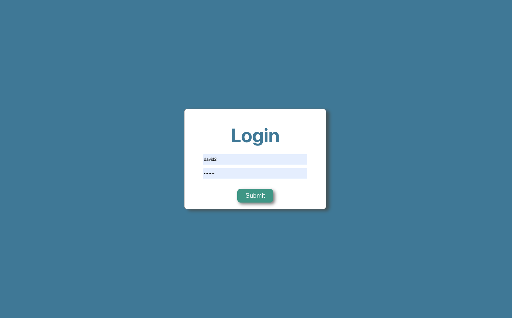
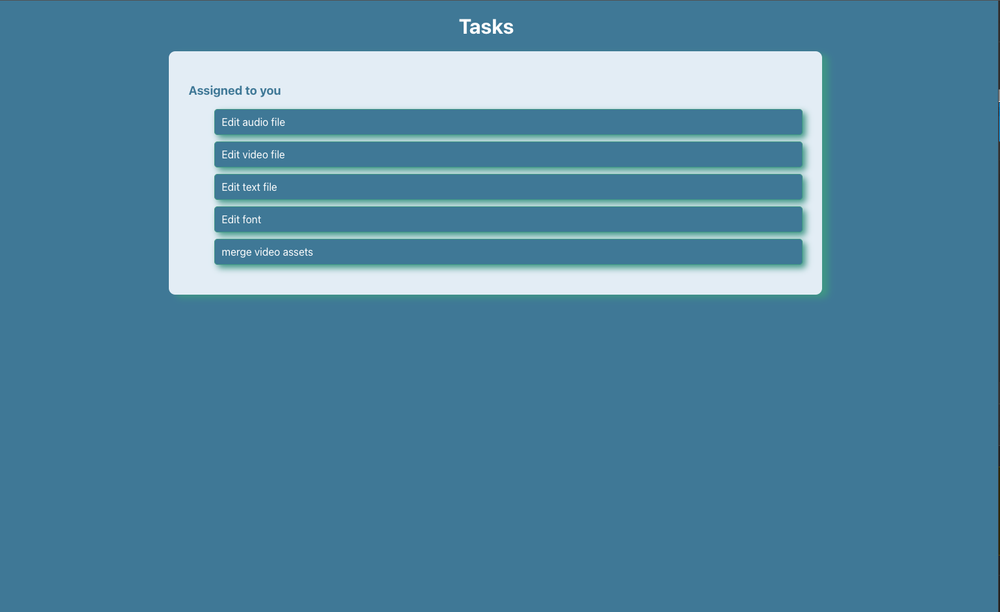
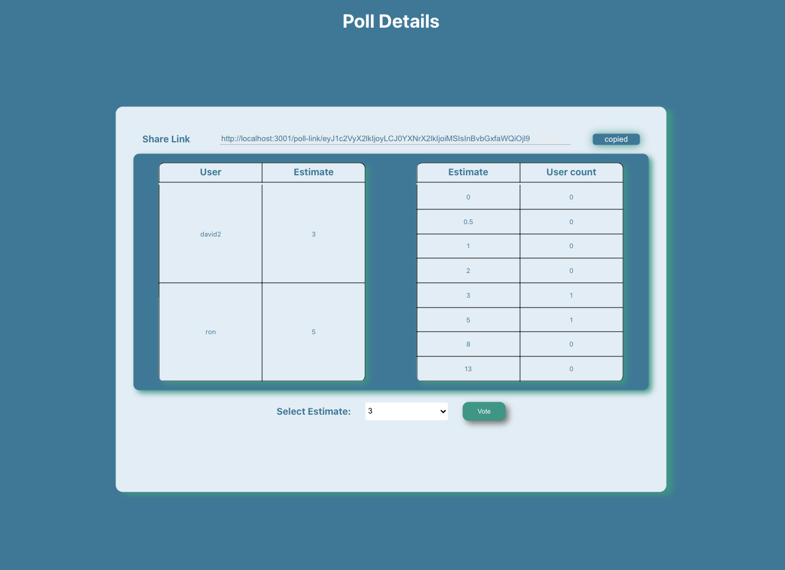

# poll-system

## Objective:

Collaborative planning app!

In order to estimate how complex a task is for a team of developers to complete, a common technique that is used is called "planning poker".
Each developer gets to vote on a task by giving their estimate as a point.
The set of points you can cast your vote on is usually a predefined set of arbitrary numbers, something like this: 0, 1/2, 1, 2, 3, 5, 8, 13.
The higher the number, the more complex the task is to complete.
When everyone has cast their votes, the team can have a discussion about what points the different team members have given to a task.

This application should allow the team members to vote on a "task" and visualize the results of the vote in real-time.

The users of the application should be able to do the following:
Create a poll. A user creates a poll and can share this with other people (this could for example be a code or a link).
Join a pre-existing poll created by you or someone else. You should be able to cast your vote on different points in a predefined set (0, 1/2, 1, 2, 3, 5, 8, 13). A user can only vote once, but is permitted to change their vote.
Visualize the results in real-time of a poll: Anyone should be able to see the results of a poll. If user A is casting a vote "2", user B should in real-time be able to see that the point "2" has a value of 1

## Design and Architecture

### Tech stack

- Ruby on Rails
- React
- sqlite/pg (production)
- websockets through @rails/actioncable
- No other js/css libraries

#### 1. User enters login screen

- if username and password matches, user is authenticated and logged in
- if user is not present in the system new user is created and logged in to system
- if user enters incorrect password, error message is displayed
- user data is stored for logged in user in local storage

#### 2. User sees tasks index page

- This screen fetches all the tasks created on the system
- The user can go ahead and create a poll on a task for estimation

#### 3. User enters poll details screen

- on poll creation a websocket connection is created
- the connection is subscibed to a poll id
- any updates to the poll are broadcasted to all subscribers
- there is a copy link button to invite other users to vote their estimation

## local setup:

Pre-requisites

- ruby 2.7.0
- Rails 6.1.3.2
- node v14.17.1
- npm 6.14.13

Steps to run on local:

- start a server

  - git clone git@github.com:mayuriardad/poll-system.git
  - rake db:create
  - rake db:migrate
  - rake db:seed
  - rails s

- run frontend application
  - npm install
  - npm start

Note: please ensure that you have rails server running on 3000 port and APP running on port 3001

## TODO

- Show description on tasks list, assigned name, estimate
- Add way to update task estimate after final decision (frontend)
- Maintain application state on page reload
- Write storage wrapper and utility functions
- Poll already exists warning msg modal (see results of previous poll/start new poll)
- Login validation error
